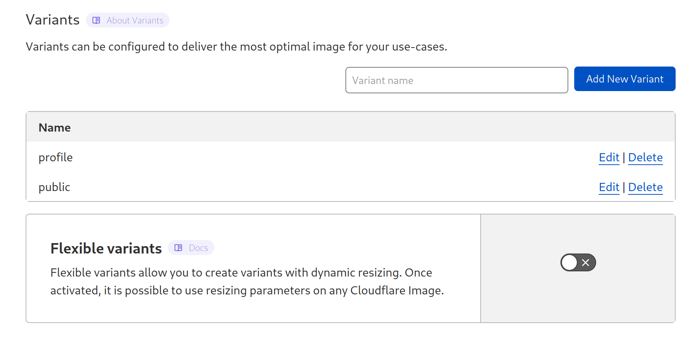
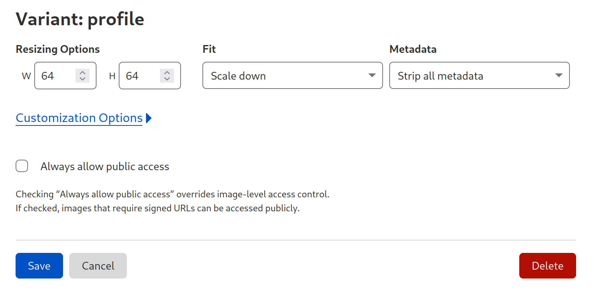
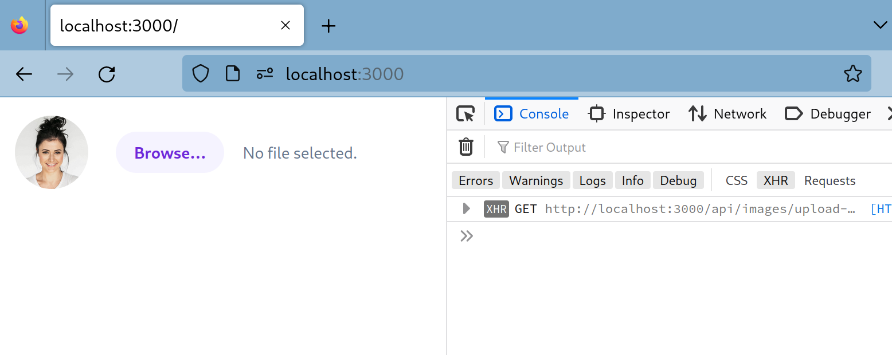
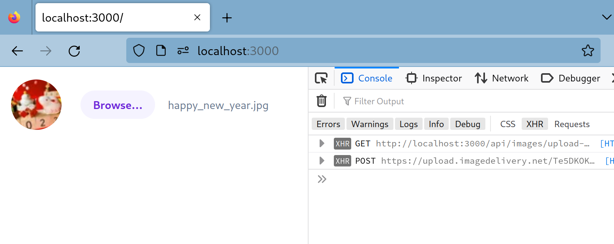

# Cloudflare Imagesを使ってみる
プロフィール画像のアップロードなどにCloudflare Imagesを利用できないか検討するためのプロトタイプです。

アップロード用のワンタイムURLを作成してクライアント（ブラウザー）からはCloudflareへ直接アップロードしてもらう方法
[Direct Creator Upload](https://developers.cloudflare.com/images/cloudflare-images/upload-images/direct-creator-upload/) を利用します。

## セットアップ
必要なもの：
- 課金
- API Token
- Account ID, Delivery URL

### 課金
Cloudflare Imagesのページを開くと、利用するためには課金を求められるので最小のプランを選択して課金してください。

2023-01現在、最も安いものは$5/monthです。

### Variant作成
プロフィール画像向けに派生URLを作成（設定）します。

Images -> Variants のページから `profile` という名前で作成してください。
サイズを64x64などにスケールダウンするように設定してください

variant名は次の形式で画像のURLとして利用されます：  
`https://imagedelivery.net/<account_hash>/<image_id>/<variant_name>`

<hr />






### .env
`.env`ファイルの中身を埋めてください


## 起動
```bash
make run

open http://localhost:3000
```

<hr />

ファイル選択ボタンを押すと裏側でワンタイムURLを取得しています。


ファイルが選択されるとアップロードされて画像のIDが得られるので\[profile]の画像URLへ参照を切り替えています。


## おそうじ
必要に応じてCloudflare Imagesの課金を停止してください。
